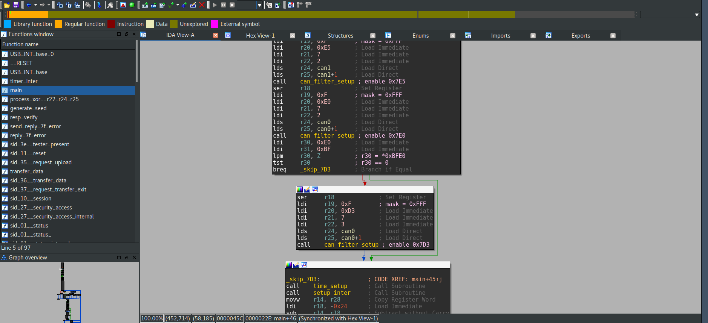

## Auto-psy (500)

### Description

Our previous experiment proves that the DeLorean is indeed a functional time machine; we need to recover the secrets behind this technology. Our technicians successfully isolated the cluster of ECUs containing the time travel technology. We have also found a data SDcard connected to the cluster. The data, however, is encrypted - and that’s where you come in. We need you to obtain access and extract the secret key which must be stored somewhere inside the ECUs. This ECU cluster appears to contain only one microprocessing unit. We believe this unit contains the functionality of several ECUs, together with a gateway, or gateways, managing traffic between the relevant interfaces. The bus containing the cluster also included a legacy external OBD-II port, which we believe may have been used by vehicle mechanics for diagnostic purposes.
Note that the vehicle dashboard is probably no longer of use at this point.

Best of luck.

### Write-up

The hardest task developed by Argus.

The task emulates work of small subset ECUs available in a car. Sniffing CAN traffic reveals some internals to start with:
```
id: 0x7e5 payload: b'\x02\t\x00\x00\x00\x00\x00\x00' 7E580209000000000000
id: 0x7ed payload: b'\x06I\x00@@\x00\x00\x00' 7ED80649004040000000
id: 0x7e5 payload: b'\x02\t\n\x00\x00\x00\x00\x00' 7E5802090A0000000000
id: 0x7ed payload: b'\x10\x16I\nPwrT' 7ED81016490A50777254
id: 0x7ed payload: b'!rain_Ct' 7ED8217261696E5F4374
id: 0x7ed payload: b'"rl\x00\x00\x00\x00\x00' 7ED822726C0000000000
id: 0x7ed payload: b'#\x00\x00\x00\x00\x00\x00\x00' 7ED82300000000000000
id: 0x7e5 payload: b'\x02\x01\x00\x00\x00\x00\x00\x00' 7E580201000000000000
id: 0x7ed payload: b'\x06A\x00\x00\x08\x00\x03\x00' 7ED80641000008000300
id: 0x7e5 payload: b'\x02\x01\r\x00\x00\x00\x00\x00' 7E5802010D0000000000
id: 0x7ed payload: b'\x03A\r\x8d\x00\x00\x00\x00' 7ED803410D8D00000000
id: 0x7e5 payload: b'\x02\x01\x00\x00\x00\x00\x00\x00' 7E580201000000000000
id: 0x7ed payload: b'\x06A\x00\x00\x08\x00\x03\x00' 7ED80641000008000300
id: 0x7e5 payload: b'\x02\x01\r\x00\x00\x00\x00\x00' 7E5802010D0000000000
id: 0x7ed payload: b'\x03A\r\x8d\x00\x00\x00\x00' 7ED803410D8D00000000
id: 0x7df payload: b'\x02\x01\x00\x00\x00\x00\x00\x00' 7DF80201000000000000
...
```

The first thing that catches the eye is some ASCII text splitted over several CAN messages. OBD-II in task description hints there are some upper protocols used over CAN. Reading a bit documentation reveals that the board talks with [UDS](https://en.wikipedia.org/wiki/Unified_Diagnostic_Services) protocol. The protocol provides a way to request diagnostic from different ECUs. To request a message you need to know service id (sid), sub-function (sub) and required payload. And UDS protocol standardizes all these things.

```
id: 0x7e5	uds	sid: 0x9	sub: 0x0	payload: b'' ()
id: 0x7ed	uds	sid: 0x49	sub: 0x0	payload: b'@@\x00\x00' (40400000)
id: 0x7e5	uds	sid: 0x9	sub: 0xa	payload: b'' ()
id: 0x7ed	uds	sid: 0x49	sub: 0xa	payload: b'PwrTrain_Ctrl\x00\x00\x00\x00\x00\x00\x00' (507772547261696e5f4374726c00000000000000)
id: 0x7e5	uds	sid: 0x1	sub: 0x0	payload: b'' ()
id: 0x7ed	uds	sid: 0x41	sub: 0x0	payload: b'\x00\x08\x00\x03' (00080003)
id: 0x7e5	uds	sid: 0x1	sub: 0xd	payload: b'' ()
id: 0x7ed	uds	sid: 0x41	sub: 0xd	payload: b'\x8d' (8d)
id: 0x7e5	uds	sid: 0x1	sub: 0x0	payload: b'' ()
id: 0x7ed	uds	sid: 0x41	sub: 0x0	payload: b'\x00\x08\x00\x03' (00080003)
```

After a little bit bruteforcing we found that ECU 0x7E0 responses with 0x33 code (security access denied) to a _request data upload_ message (sid 0x35) which could allow us to dump its memory.

So there must be some way to gain access to protected functions. UDS specifies sid 0x27 (security access) for such purposes. The board uses challenge-response algorithm which is unknown to us. But the size  of a response code and absence of countermeasures allowed us to bruteforce it fast. ECU provides you a challenge and you could respond to it with fixed response. About 1-2 minutes and you successfully authorized.

Using previously secured _request data upload_ (sid 0x35), _transfer data_ (sid 0x36) and _transfer data exit_ (sid 0x37) we managed to dump addresses from 0x0000 to 0x8000. Addresses higher than 0x8000 were inaccessible.

Reversing time. Downloaded firmware reveals a lot of secret. Here is a tree of available ids, sids and subs:

```
0x7E0:0x7E8 - gateway [CAN0]: FlxCap_Gateway
 0x01 status
  0x00 -> payload: 00000002
  0x1F
 0x10 session
 0x27 security access
 0x35 request upload
 0x36 transfer data
 0x37 transfer data exit
0x7D3:0x7DB - secret ecu [CAN0] (flag, address C000) FlxCap_Ctrl
 0x01 status
  0x00 ??
  0x1F -> payload: 0B0F/0D0A (timer value)
 0x10 session
 0x27 security access
 0x35 request upload
 0x36 transfer data
 0x37 transfer data exit
 0xA0 flag
  0x00 flag
0x7E5:0x7ED - powertrain ecu [CAN1] PwrTrain_Ctrl
 0x01 powetrain
  0x00 -> payload: 00080003 (fixed)
  0x0D -> payload: 8D (fixed, request current powertrain)
  0x1F -> payload: 0B0F/0D0A (timer value)
  0x20 -> payload: 00000001 (fixed)
  0x40 -> payload: 40000010 (fixed)
  0x42 -> payload: 2EE0 (fixed)
  0x5C -> payload: 8700 (fixed)
 0x10 session
 0x27 security access
0x7DF:XXXXX - broadcast
```

After analysis the task to get the flag becomes very clear:
1. Set maintenance mode of _FlxCap_Ctrl_ with sid 0x10
1. Authorize against _FlxCap_Ctrl_ with sid 0x27
1. Request the flag with sid 0xA0

And it worked. Almost. We were getting garbage instead of the flag (bug). But nevertheless we managed to get original flag from the firmware. At this time the task was disabled due to bugfixing.

We returned to the task after bugs were fixed. The flag we obtained was not valid.  But this time filtering worked as supposed to from the start. 

The board configures CAN filtering (firewall like) during initialization and our _FlxCap_Ctrl_ ECU is only enabled if variable at 0x2146 (0xBFE0 after bugfix) is not zero. Luckily for us before bugfix the task read from 0x2146 address of SRAM not ROM. Thus _FlxCap_Ctrl_ ECU worked normally. But this time _FlxCap_Ctrl_ ECU was disabled and this prevented us from sending direct messages to it.



Our hope was to exploit broadcast address 0x7DF. But firmware code didn't allowed us to do this. Only sids 0x01 and 0x09 are allowed in broadcast.

Write to 0xBFE0 wasn't feasible. Thus the only way was to inject SPI command and enable _FlxCap_Ctrl_ ECU. But after a small talk with organizers they decided to score us the task.

For more information refer to task files available in the repository.