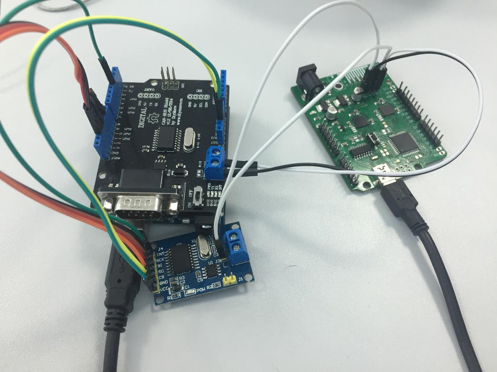
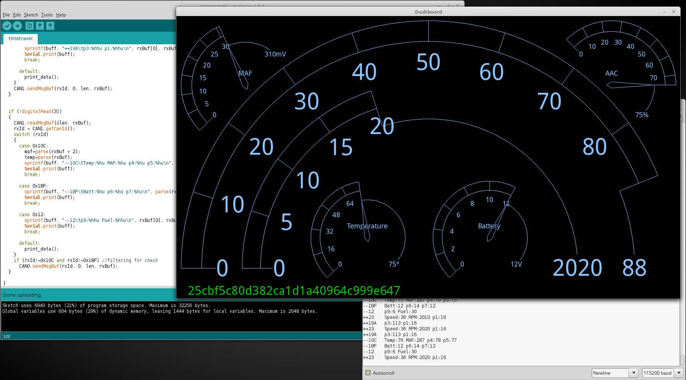

## Back to the future (250)

### Description

Our intelligence suggests that the DeLorean we previously recovered is capable of time travel.
According to the documents in our possession the time travel functionality is activated as soon as a specific ECU within the vehicle maintains a velocity of exactly 88 miles per hour for at least a few seconds. We rely on your CAN bus expertise to trick the time-travel ECU into thinking it is travelling at the right speed; again, the vehicle dashboard we restored should be of use.

Best of luck.

The Dashboard app is available here.

Challenge developed by Argus Cyber Security.

### Write-up

This task similar to CAN Opener challenge with same dashboard app, CAN traffic have same messages, except two new message types added (id 0x19A and 0x12). Setting speed to 88 mph is not trivial task, because if will try inject CAM messages directly to bus - dashboard will be receiving injected speed among legitimate and speed value will be jumping. 

To avoid such effect we need to implement MiTM scheme, for this purpose we cut traces on the board and used two CAN controllers to modify CAN traffic in transit. We used Arduino Uno and two CAN boards with MCP2515 chip (shield version and small board).

After coding a little Arduino sketch we can easily relay traffic between CAN endpoints and modifying any parameters. Using this setup setting speed to 88 mph comes smoothly without lags, but flag still isn't appearing. Periodic blinking of yellow check engine gives some hint, that still something isn't right. 

It took for several hours by playing with different values in CAN messages, trying to locate correlation with check light, at some moments process resulted in total brute forcing, but unexpectedly flag appeared on the dashboard, correct option was filtering out messages with id 0x10C and 0x1BF.

Here's 250 reward for nice guess)
