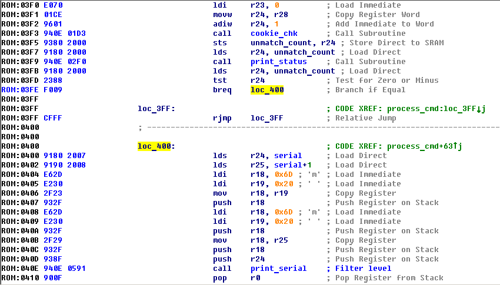

## Benzinegate (500)

### Description

This is a simple CO exhaust level regulator. It sets the levels according to the regulations. Or does it? We suspect hidden functionality. Can you help us confirm?

### Write-up

This task sounded challenging, combination of fault injecting, reverse engineering and exploitation, but turned in to quite easy task due to possibly unplanned bug.

CO regulator implements loop with vulnerable input, 32 byte input overflows 22 byte stack buffer, which is sufficient for making two chosen calls. But things a little bit complicated, because buffer is protected with random 64 bit stack cookie. During input processing if cookie isn't correct you will get **X** letter for every unmatched byte and program jumps to infinitive loop. Sounds like nice targets for glitching.

We decided to use ChipWhisperer for VCC glitching, since RHME3 board use internal clock (which quite unstable). Next problem is that in current challenge doesn't provide external clock for CAN controller and it's not possible to sync clock between CW and RHME3 (like we did in SCA tasks), that's why hitting proper execution instruction will involve in continuous glitching until you success (if so:)). And of cause you need to make few patches to CW software (which should be usual if you are lucky owner of CW), you will need to send custom bytes to serial input.

Point for fault injection is perfectly marked and contains bunch of NOPs and LED trigger, this one is hard to miss, and power traces looks quite pretty:

Idea is simple provide input with ROP payload and insert glitch to bypass stack cookie check between NOP blocks, if you see only one NOP block than you have to repeat.

In case of success - flag mask will be set at *0x2b1* and calling *flag_precalc()* (0xb62), *flag_print()* (0x2ba) using ROP will allow to retrieve flag.

But before starting continuous hitting board with power glitches is good idea to test your setup, infinitive loop is good case for this:

As it was mentioned, when stack cookie is incorrect firmware jumps to infinitive loop, you can you CW manual trigger to exit loop and jump to next instruction (used glitch parameters 48% pulse with, -5% period offset and 5 repeats). Exiting loop also gives the ability to check ROP payload and allows print masked flag.

When I was playing with ROP payload I could successfully taking controll of execution and print masked flag with *flag_print()* (0x2ba) function, but when I was adding *flag_precalc()* (0xb62) to ROP chain board was resetting, was looking like address isn't correct, was that another bug?

Since I really wanted to solve this task using fault injection I didn't used *printf* bug that I located during examining binary. I used "%S" option and my script from RHME2 casino challenge to dump firmware, and I was quite surprised that flag precalculation had some changes, additional constants was added to calculation, this caused address shifting of next functions.

At that moment we already had all needed component for flag calculation and continuous glitching with unreliable output wasn't looking fun, so few patches and Atmel emulator did their job)

Looks like it wasn't planned but medium fault injection task became pure exploitation, comparing to Lockdown challenge (where double glitch is expected for 300 point) this 500 point is an easy hunt. Python dump script is available in github repository.
