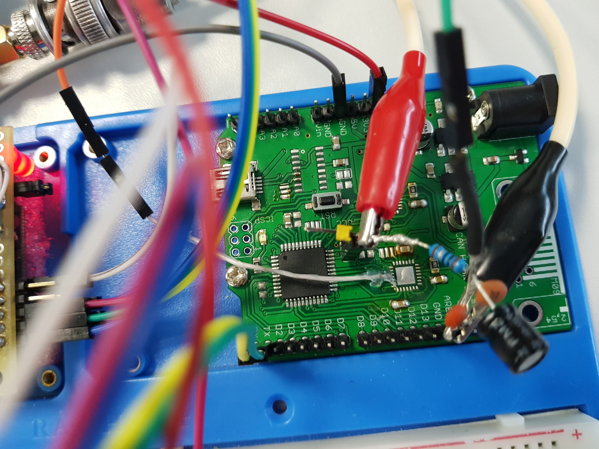
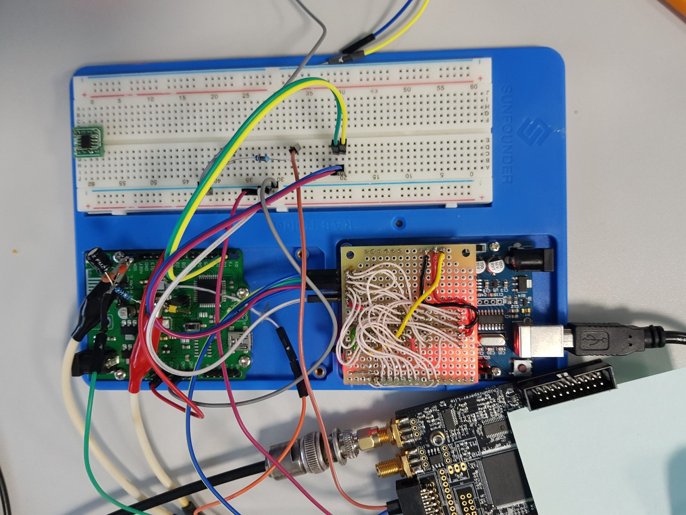

## Board modification

There were several side-channel analysis and fault injection tasks which required board modification. Organizers provided board 
[design](https://github.com/Riscure/Rhme-2017) to ease modification.

Here is what we did:
* Removed capacitors C17, C16 and C7
* Removed usb-to-serial chip CH340G
* Cut track at JP4;
* Added shunt resistor 10 Ohm before VCC pin to measure current
* Added some filtering before shunt resistore

For hardware tasks we used:
* [Chipwhisperer](http://newae.com/tools/chipwhisperer/). For SCA and FI
* [DSCope](http://www.dreamsourcelab.com/). Oscilloscope
* [Saleae Logic](http://saleae.com/). Logic analyzer 
* Arduino with 2 CAN-Bus shields. For CAN tasks and additionally as trigger for SCA tasks
* BeagleBone Black. For Key Fob task

Photos:

