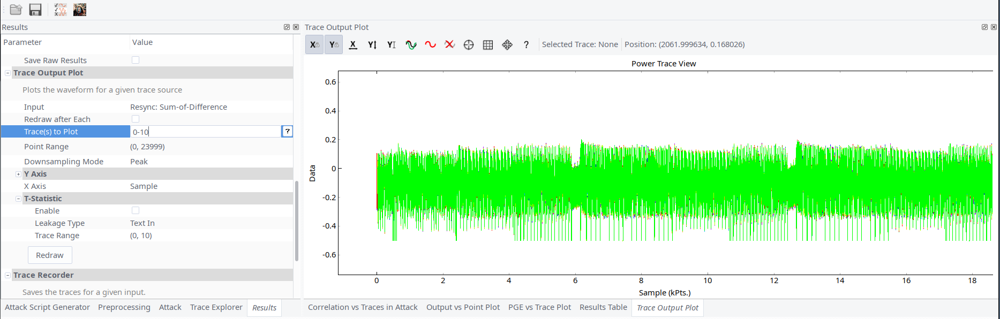
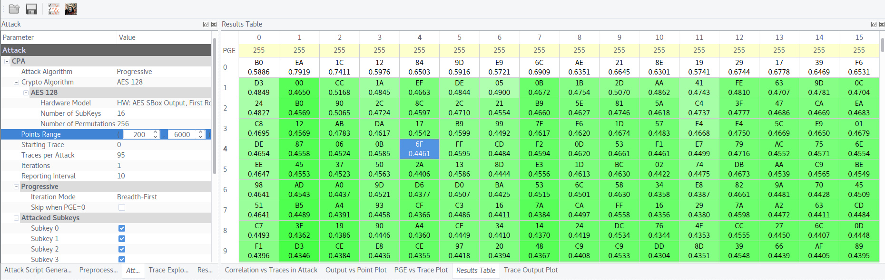
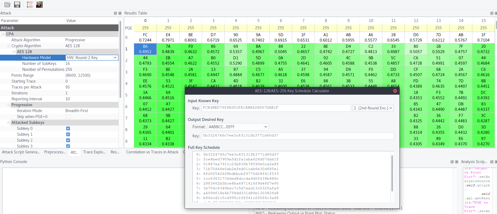

## It's a Kind of Magic (200)

You managed to get a spare key fob for the car you like. However you want to duplicate it so that you can maintain your access to it. Through extensive reverse engineering, you figure out that the device accepts an input challenge performs AES-128 encryption (or decryption) and returns the response. It is also identified that the device operates on masked input and returns masked output. Extract the key so you can get free rides!

The device expects 18 bytes of input: the first byte should be either 0xAE (for encryption) or 0xAD (for decryption) followed by 16 bytes of data, followed by a newline.

## Write-up

The easiest side channel analysis challenge. After some [hardware setup](hw.md) and multiple configuration tries, we were able to get traces with help of Chipwhisperer. The first obstacle for us was all traces were out of sync.

The issue was unsynchronized clocks on Xmega and Chipwhisperer. Unlike previous RHME this time chip was clocked using internal oscillator. But after poking around we found there was a clock signal for one of CAN controller available. This allowed to synchronize Chipwhisperer with the board. It's a pity that FI challenges didn't have clock available.

Chipwhisperer software was slightly patched to support the board. And traces acquisition question was closed.

We assumed that masking was just XORing input with random mask (changed every boot). Such masking resembles an attack on AES-CCM which is described in ["IoT Goes Nuclear: Creating a ZigBee Chain Reaction"](http://iotworm.eyalro.net) paper.

Our plan for the attack consisted of 3 steps:
1. Attack AES _SubBytes_ on the 1st round. Here we are able to get not real key but `round_1_key ^ mask`.
    

1. Attack AES _SubBytes_ on the 2nd round because we can finish the 1st round on our own:
    - 1st round input is `plaintext ^ mask`
    - 1st round _AddRoundKey_ and _SubBytes_ is `SBox[plaintext ^ mask ^ round1_key]`. At this step all variables and we could calculate `round_1_output` by ourselves
    - 2nd round  _AddRoundKey_ and _SubBytes_ is `SBox[round_1_output ^ round_2_key]`

    

1. And the last step is to calculate AES key from `round_2_key`.