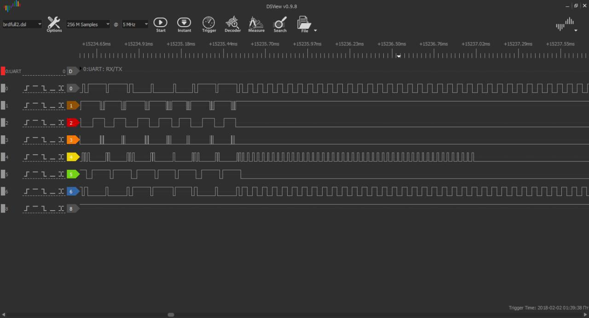

## Phonic Frenzy 1 (100)

### Description

Your car has a brand new infotainment center. In order to activate the system you have to register the serial number on the company's website. The only problem is, it's not trivial to find the dang thing.

### Write-up

Quite easy challenge if you won't get caught in a trap)
If you connect RHME board to logic analyzer  you will see a strange protocol at A0-A5, Aref:

This protocol significantly distracted our attention for long time) Signals is divide on some sort of parcels, first one is long in the beginning and 32 short parts after, which was looked like some encoded prompt and flag bytes. Among our most interesting assumptions was:

- LCD signal;
- PWM modulated sound;
- Shift register for LED display,
- Analog video.

But everything was wrong, until we checked pins with analog scope, we was very surprised how easy things was. D7-D8 pins revealed analog audio signal, synthesized voice with poor quality just pronounced flag bytes)

Last part of the puzzle here is to differentiate **B** **D** and **E** letters, looking precisely on signal oscillogram may help, but anyway you will have to brute force a little bit and solve some google captchas with lovely road signs and store fronts, if you lucky enough another 100 pints will be yours.