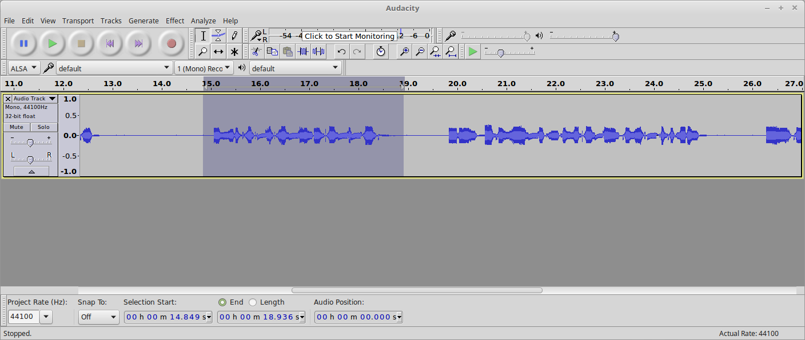
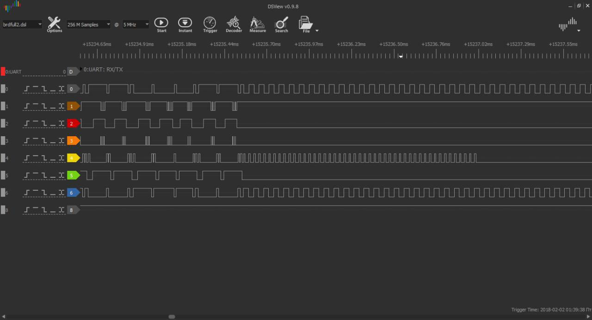

## Phonic Frenzy 2 (200)

### Description

Hmm, when registering your serial number on the website, you saw that there is also an 'upgraded' version of the infotainment center available with better options for everything! And better yet, apparently the only difference between the two systems is that the upgrade has some kind of wiring harness that needs to be connected to enable the extra functionality. Maybe we can rig up something ourselves in order to unlock this functionality?

### Write-up

It's next challenge which use uber cool synthesized voice, this time we need to find out proper wire connection to get the flag.

At first good idea is to check which pins are used for input and which for output, this can be done by pulling pin voltage to opposite level (3.3v -> grn or grn-> 3.3v), to avoid short circuit we can use 10k resistor. As result we can see that D2-D6,D9-D13 is in input mode, D7-D8 is used by DAC for voice playing, and A0-A5,Aref is used for wierd protocol from previous challenge. Some assumptions was that A0-A5 can switch to input mode between packet sending, but test with resistor confirmed that all pins are in output mode.

Next assumptions was that challenge may use some of hardware capabilities like:
- I2C;
- SPI;
- UART;
- USB.

But pulling voltages on pins responsible for hw io hasn't give any effect. And the only things left without attention is kraftwerk style voice) 

During first attempts of listening it seems that voice just repeats text printed on serial interface, but if you listen precisely  (after ~10 attempts you will have some level up and your recognition skill get some upgrade)) you can hear some word that sounds like "frequency", "active", "inverted". If will listen this a few times more you can recognize that this some connection errors, which gives a clue what to do next.

For convenience you can connect D7 or D8 pin to audio recorder and then playback chosen part after every change you made, as for me I used Audacity.

Next I tried to pullup pins in input mode to 3.3v and looked  how it affects error messages:

- pulling D2 removes "inverted frequency" error;
- pulling D3 change error to "frequency" doesn't match;
- pulling D4 removes "IO active" not as expected model;
- pulling D5 removes "inverted IO  welsh" error.
- pulling D6 adds "IO prepare" error.

During playing with pins I recalled that strange protocol from previous challenge has 2 pairs of inverted signals, bingo things are easier than was expected, all we need to do is connect wires in proper order.

By looking at picture above we can see that signal pairs of **0**,**6** and **1**,**3** are inverted, both of them when connected to D2 and D3 removes "frequency error". Meanwhile we can try to guess "IO active" among 3 candidates only signal **5** matches, that's good, going next. After several tries to find proper connection for D5 we discover, that only **0**,**6** signal pair match as "frequency" (pin D2,D3), and signal **1** matches "inverted IO welsh" on D5, in other case more errors appears. Few next tries revel that D6 responsible for "IO prepare" and signal **4** match it. Last left candidate - signal **2**, can be connected to D10 pin which successfully activate your "security module" and brings out your flag (for some reason signal **3** left unconnected).

But challenge isn't over yet, you still have to complete next portion of google captchas waiting for you, while you'll be guessing was it **A** or **8**, maybe this time you will be more lucky))
