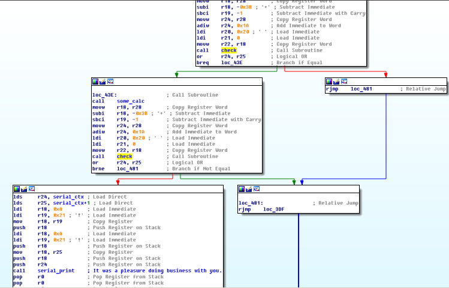

## Ransom (50)

### Description

In theory, this firmware mod was supposed to give you 30% extra horsepower and torque. In reality, it's something different. For real this time.

### Write-up

Most easiest task due to possible bug, which was fixed in Ransom 2.0.

First we need to locate *vfprintf* function from libc (large and complicated) and using cross-references we can move up and locate *serial\_print*. By inspecting *serial\_print* calls and its parameters (string pointers) we can map displayed messages with code branches.

Among the strings in firmware most interesting for us is this one:

	RAM:210A "It was a pleasure doing business with you.\nYour car is now unlocked."

By looking at code tree of *main* function we can see repeating loop of prompt printing, input reading, double call of *check* input function (FI countermeasures) and conditional jump with "unlocked" branch. 

*Check* is just time-safe memory comparison function (xor) with one interesting bug, someone missed loop increment and comparison  checks only first byte of input, sounds nice)

Next we need lo move up by code tree to locate unlock key generation at SP+0x3B, and here we see interesting string "%02X", which means that unlock key is hexadecimal text, all we need to do is to try only 16 hex digits.

Flashing firmware to RHME3 board, several tries and we have 50 points.
