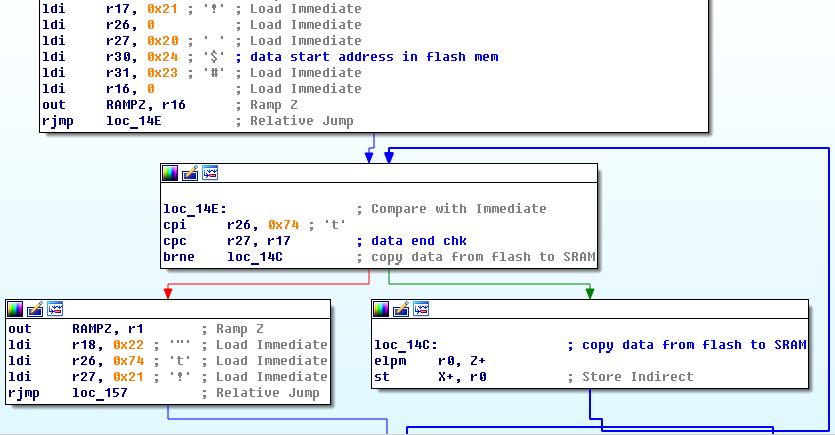
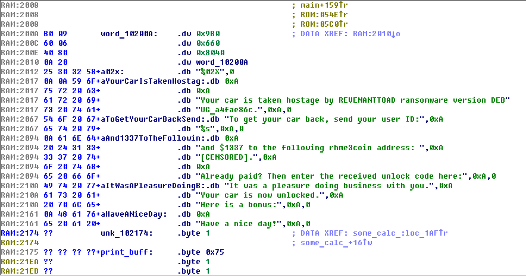

## RHME3 Firmware Reversing Hints

RHME3 board is using ATxmega128A4U MCU, this datasheets is publickly available and have all suffisient information for detailed understanding:

- [AVR-Microcontroller-XMEGA-A4U_Datasheet](http://ww1.microchip.com/downloads/en/DeviceDoc/Atmel-8387-8-and16-bit-AVR-Microcontroller-XMEGA-A4U_Datasheet.pdf)
- [XMEGA AU Manual](https://eewiki.net/download/attachments/31588436/XMEGA-AU_Manual.pdf)

Brief information from datasheets may come in handy during reversing:

- Reset and interrupt vector offsets;
- Data memory mapping;
- Peripheral address mapping.

> You can add this information in IDA cfg file for AVR processor, but due to some internal bug peripheral addresses is displayed with 0x20 offset.

Since all challanges were built using *avr-gcc* [avr-libc](https://github.com/vancegroup-mirrors/avr-libc/tree/master/avr-libc) source code will be helpful.

> Unfortunately IDA flair engine currently doesn't support AVR assembler and all libc functions matching should be done using your eyes.

First thing you need to do after loading firmware binary to analysis tool is to locate static data section and load it to proper address (0x2000 SRAM). Start of the data section and size can be found in reset handler vector.

If you are using IDA, data section can be loaded through *File*->*Load File*->*Additional binary file...*, loading segment **0x10200**, uncheck *create segment* and *code segment*.

Next you need to locate at the end of binary generic libc functions, which usually are *memcpy*, *memset*, *printf*, *malloc* etc. By looking through cross-refs of *printf* we can find points of printing strings to UART. This will help more quickly analyse high level logic of analysed firware.