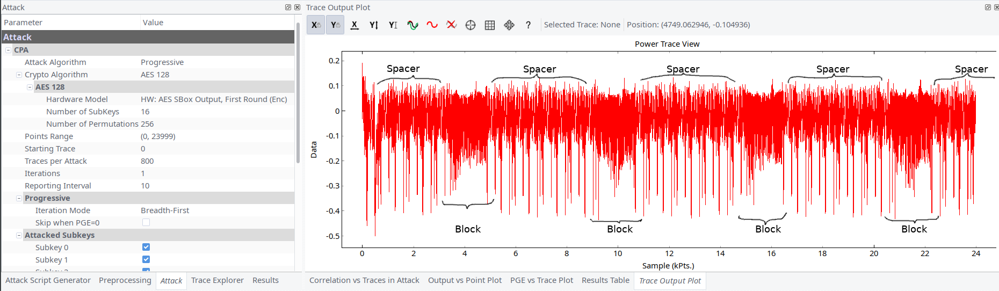
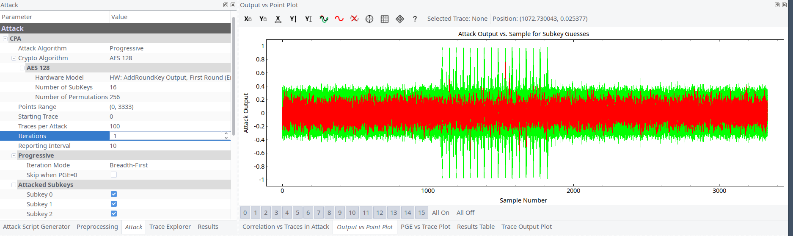
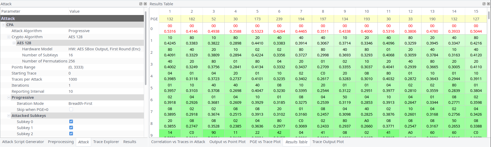
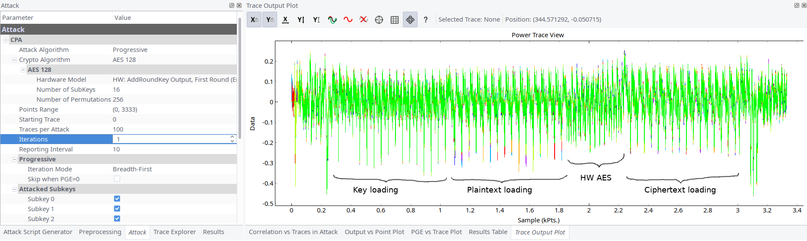
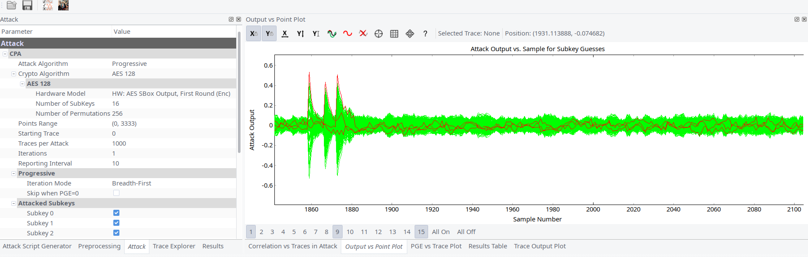
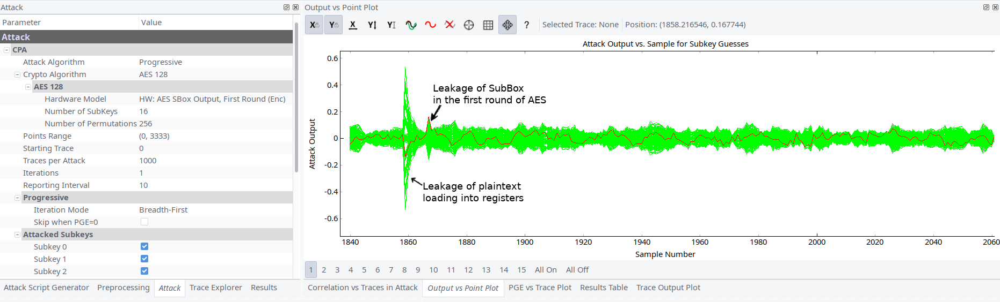

## The Imposters (350)

### Description

The manufacturer has figured out someone is using SCA on their keyfobs. They have pushed out a patch for their keyfobs changing the AES implementation. The actual AES seems to be hidden inside a number of fake AES operation. Can you still get the key?

The device expects 18 bytes of input: the first byte should be 0xAE (for encryption) followed by 16 bytes of data, followed by a newline.

### Write-up

Another SCA challenge. This time captured signal had different image comparing to the previous task. There were 16 _blocks_ of operations with 16 _spacers_ prior each _block_.



The first idea was these _blocks_ are AES rounds and some of them are fakes, and we need to find out which are real ones. After thinking a bit we concluded that this idea is wrong.

Looking at _spacers_ between _blocks_ more closely it become clear that they resemble random number generation. So we need to find out what are _blocks_ actually.

Accidentally using 16 `\x00` as plaintext we saw that one of _block_ didn't had spikes. Although all other _blocks_ had. Running encryption several times we confirmed our assumption: this block had used provided plaintext. Additionally we ran AddRoundKey attack in Chipwhisperer to be sure 100%.




We repeated the AddRoundKey with resulted ciphertext and found out that ciphertext was at the end of the same _block_. The distance between plaintext and ciphertext leakages was only several hundred samples (initially we captured at 32MHz).

Reading different articles on the topic we stumbled at
https://wiki.newae.com/Tutorial_A6_Replication_of_Ilya_Kizhvatov%27s_XMEGA%C2%AE_Attack article. It looked very similar to what we had here. So the _block_ structure became clear. 15 _blocks_ are imposters and only 1 _block_ processes real plaintext. It doesn't use masking or other countermeasures, it only uses XMEGA's hardware AES encryption.



Running SubBytes attacks shows that our assumptions are correct.



In the article to simplify matters Colin pretends he has already found 1st byte of key and uses it to find next bytes of key. But in reality we cannot obtain the 1st byte, we need to brute it. This is not a problem we can find leaked XOR difference between Nth and N+1th byte of key (`guess ^ knownkey[bnum-1]`) and reconstruct original key with bruteforce:

```python
def leakage(pt, ct, guess, bnum, setting, state):
    ...
    s1 = pt[bnum-1] ^ knownkey[bnum-1]
    s2 = pt[bnum] ^ guess
    return HW(s1 ^ s2) # HW(pt[bnum-1] ^ pt[bnum] ^ (guess ^ knownkey[bnum-1]))
    ...
```

Unlike article and thesis description our leakage of byte of key is not clearly expressed, i.e. peaks are not high as we expected them to be. It's time for tedious work to determine leakages: we need to find which guess has the maximum at the second peak (see picture below). For analysis we increased capture speed to 96MHz and made about several thousands as recommends original thesis.



For each byte of key we found 1-4 candidates. Also we had plaintext and ciphertext Thus using simple tool it was possible to check all key permutations.

It took us 1 day to a number of tries with rechecks to found out correct.